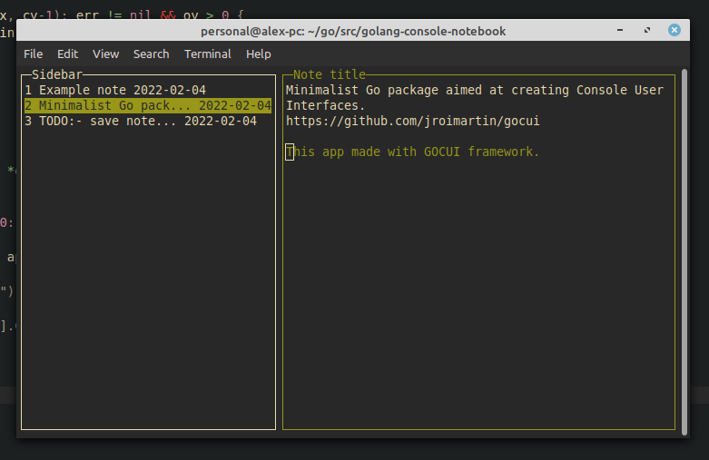

# Golang console notebook

This is simple console notebook written on golang with awesome [GOCUI](https://github.com/jroimartin/gocui 'GOCUI') framework.

---

## TODO:
- Screen renderer
- Linux installer
- save note
- update note
- create note
- add more to interface like current time, main menu, note item detail and etc...